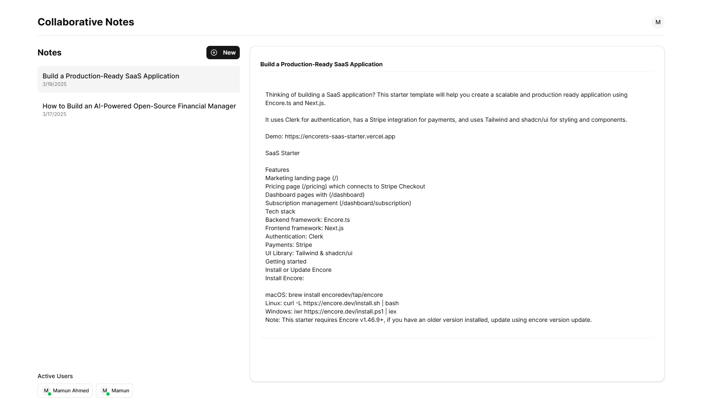

# Real-Time Note Taking Application 📝

A modern, real-time collaborative note-taking application built with Next.js, Express.js, and WebSocket technology.



## Features ✨

### Frontend

- **Next.js**: Modern React framework for optimal performance and SEO
- **TypeScript**: Type-safe development
- **Tailwind CSS**: Modern utility-first CSS framework
- **Shadcn UI**: Beautiful and accessible components
- **Real-time Updates**: Instant note synchronization using WebSocket
- **Responsive Design**: Works seamlessly on all devices

### Backend

- **Node.js & Express.js**: Robust server-side runtime and framework
- **TypeScript**: Type-safe backend development
- **MongoDB**: NoSQL database for flexible data storage
- **WebSocket**: Real-time bidirectional communication
- **JWT Authentication**: Secure user authentication with refresh tokens
- **Request Validation**: Data validation using Zod
- **Cron Jobs**: Automated task scheduling

## Live Demo 🎥

Watch the application in action:
[View Demo](demo.mp4)

## Getting Started 🚀

### Prerequisites

- Node.js (v16 or higher)
- MongoDB
- pnpm (recommended) or npm

### Installation

1. Clone the repository:

   ```bash
   git clone https://github.com/Mamunahmedbd/realtime-note-app.git
   cd realtime-note-app
   ```

2. Install backend dependencies:

   ```bash
   cd backend
   pnpm install
   ```

3. Install frontend dependencies:

   ```bash
   cd ../frontend
   pnpm install
   ```

4. Set up environment variables:

   Backend (.env):

   ```plaintext
   PORT=5000
   JWT_SECRET_AT="your-access-token-secret"
   JWT_SECRET_RT="your-refresh-token-secret"
   DATABASE_URL="mongodb://localhost:27017/realtime-note"
   NODE_ENV=development
   ACCESS_TOKEN_EXPIRES_IN=1000
   REFRESH_TOKEN_EXPIRES_IN=2000
   ```

   Frontend (.env):

   ```plaintext
   NEXT_PUBLIC_API_RESOURCE=http://localhost:5000/api
   NEXT_PUBLIC_SOCKET_URL=http://localhost:5000
   JWT_SECRET="your-jwt-secret"
   ```

5. Start the development servers:

   Backend:

   ```bash
   cd backend
   pnpm dev
   ```

   Frontend:

   ```bash
   cd frontend
   pnpm dev
   ```

The application will be available at:

- Frontend: http://localhost:3000
- Backend API: http://localhost:5000

## Features in Detail 🔍

### Authentication

- JWT-based authentication with refresh tokens
- Secure token storage and management
- Automatic token refresh mechanism

### Real-time Collaboration

- Instant note updates across all connected clients
- WebSocket-based real-time communication
- Optimistic updates for better user experience

### Note Management

- Create, read, update, and delete notes
- Rich text editing capabilities
- Note organization and categorization

## Contributing 🤝

Contributions are welcome! Please feel free to submit a Pull Request.

## License 📄

This project is licensed under the MIT License - see the [LICENSE](LICENSE) file for details.
